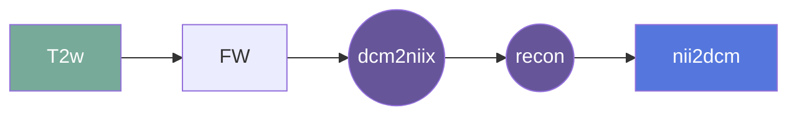

# nii2dcm
This gear generates a DICOM from the isotropic reconstruction nifti data. Use axial DICOM as the reference dicom.

## Overview

[Usage](#usage)

input = isotropic reconstruction (of nifti file to convert to dcm)  
dcm = reference DICOM file  
out = output filename   
series = series number (optional)  
desc = series description (optional)  

[FAQ](#faq)

### Summary

### Cite

**license:**
MIT License  

**url:** <https://github.com/Nialljb/fw-nii2dcm>

**cite:**  

### Classification

*Category:* analysis

*Gear Level:*

* [ ] Project
* [ ] Subject
* [ ] Session
* [ ] Acquisition
* [x] Analysis

----

### Inputs

* api-key
  * **Name**: api-key
  * **Type**: object
  * **Optional**: true
  * **Classification**: api-key
  * **Description**: Flywheel API key.

### Config

* input
  * **Base**: file
  * **Description**: input file (isotropic reconstruction)
  * **Optional**: false

### Outputs
* output
  * **Base**: file
  * **Description**: Isotropic DICOM
  * **Optional**: false

#### Metadata

No metadata currently created by this gear

### Pre-requisites

- Three dimensional structural reconstruction

#### Prerequisite Gear Runs

1. ***dcm2niix***
    * Level: Any
2. ***file-metadata-importer***
    * Level: Any
3. ***file-classifier***
    * Level: Any

#### Prerequisite

## Usage

This section provides a more detailed description of the gear, including not just WHAT
it does, but HOW it works in flywheel

### Description

This gear is run at either the `Subject` or the `Session` level. It downloads the data from the output of a previously run `CISO` analysis for that subject/session into the `/flwyhweel/v0/work/` folder and then runs the
`nii2dcm` pipeline on it.

After the pipeline is run, the output folder is zipped and saved into the analysis
container.

#### File Specifications

This section contains specifications on any input files that the gear may need

### Workflow

A picture and description of the workflow

Description of workflow

1. Upload data to container
2. Prepare data by running the following gears:
   1. file metadata importer
   2. file classifier
   3. dcm2niix
3. Run the ciso gear (Hyperfine triplane aquisitions)
4. Run nii2dcm

### Use Cases

## FAQ

[FAQ.md](FAQ.md)

## Contributing

[For more information about how to get started contributing to that gear,
checkout [CONTRIBUTING.md](CONTRIBUTING.md).]
